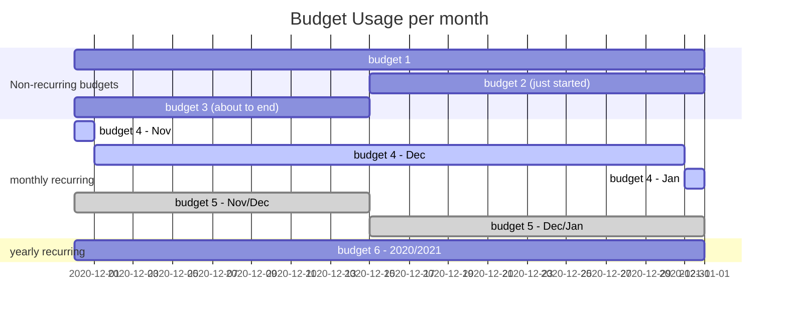

## Budget Versions

Budget can be created and edited, but we need to preserve every state of the budget.
For example a budget that has 20h per month is edited after a year, the client now pays for 30h.
The budget should therefore have a version with 20h p/m in the first year and 30h p/m from there on.
A budget therefore consists of two entities `Budget` and `BudgetVersion`.
More details can be found in the [High Level Design](high-level-design.md#budgets-versions-and-periods)

There is a `BudgetVersionService` with one responsibility: `createAndReplaceVersion`.
That method mainly exists of three parts.

### 1. Validate the effectiveFrom field
The effectiveFrom date tells when the new version should be effective for the budget.

1. Budgets without a renewal frequency can only be changed for the whole duration of the budget.
   Therefore, the `effectiveFrom` should be equal to the `budget->startedAt` date.
2. When the budget is being created, the effectiveFrom must also be equal to the starting date of the budget.
3. If the budget does have a renewal frequency, effectiveFrom should be equal to the start date of one of its [periods](#periods). 

### 2. Create new BudgetVersion
As simple as it sounds, it just created another record in the budget_versions table.
It will have an effectiveFrom date.
The effectiveTo date will be `null`, implying that this version is active without an end.

### 3. Invalidate overlapping versions
When a new version has been made there is still an old version with `effectiveTo = null`.
This version should get an effectiveTo equal to the new versions `effectiveFrom - 1 minute`.

The new version can be effectiveFrom on any date in the past, and overlap one or more versions.
If the new version completely overlaps the old version, the old version is obsolete and soft deleted.
If the new version partially overlaps old version, it's `effectiveTo` field will be updated.

## Daily Progress

tbd...

## Periods

`Periods` are dynamically generated when the `$budget->periods` relation is called.
A budget will always have a collection of one or more `Periods`

For budgets without a renewal frequency there is just one Period that has the same `startedAt` and `endedAt` as the budget.

For budgets with a renewal frequency we start the first `Period` on the `$budget->startedAt` and loop trough dates till `endedAt` is reached.

```php
$date = $budget->startedAt;
do {
    $periods->push(
        Period::create()
            ->setStartDate($date)
            ->setEndDate($date->clone()->add(1, $frequency)->sub(1, 'second'))
    );
} while ($date->add(1, $frequency)->isBefore($endDate));
``` 

## Budget Usage Service

For reporting and checks there is a need to list all the usage on budgets in a given month.
The BudgetUsageService will compile a collection of `BudgetMutation` objects.

A BudgetMutation looks like this.
```php
Class BudgetMutation {
    public BigDecimal $startBalance;
    public BigDecimal $usedCredit;
    public BigDecimal $expiredCredit;
    public BigDecimal $usedOutOfBudget;
    public BigDecimal $endBalance;
    public BigDecimal $renewedCredit;
    public Budget $budget;
}
```

To understand all the steps in the BudgetUsageService you need an overview of all possible situations.



| variable | description |
| -------- | ----------- |
| `$startBalance;` | is value that the budget 'started with' either on 01-12 or the moment it started in the month (like budget 2) |
| `$usedCredit` | the credit that was used from the budget, without going negative. For budgets that renew hours used during the second period are also counted on 31-12  |
| `$usedOutOfBudget` | the credit that was used from the budget after it ran out |
| `$expiredCredit` | the amount of credit that was left remaining on the period ended in the given month (cq. the period that was running on 01-12) |
| `$endBalance` | the credit of the period that was running on 31-12 |
| `$renewedCredit` | the `$budget->initialMinutes` if the budget was renewed in the given month otherwise zero |

The values are validated by this equation

```php
$startBalance - $usedCredit - $expiredCredit + $renewedCredit === $endBalance
```

## Minutes Spent

tbd...
