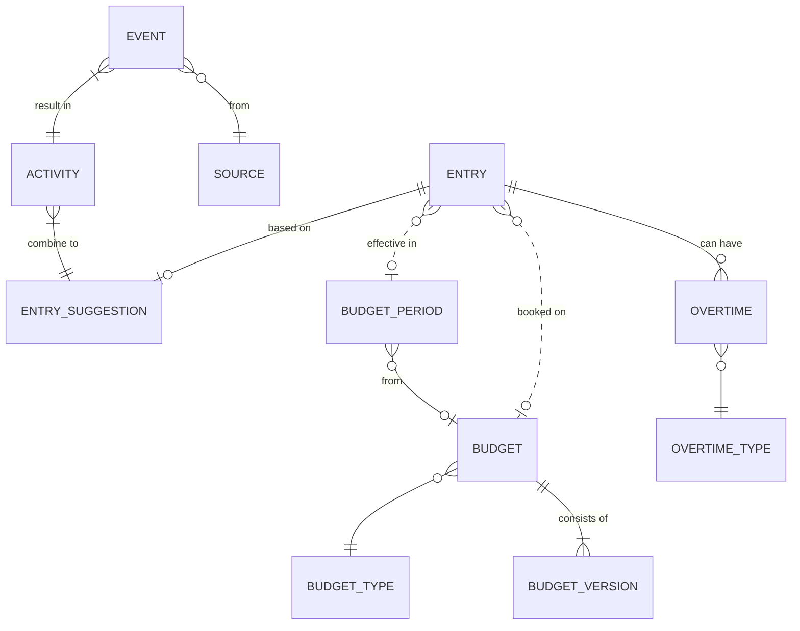
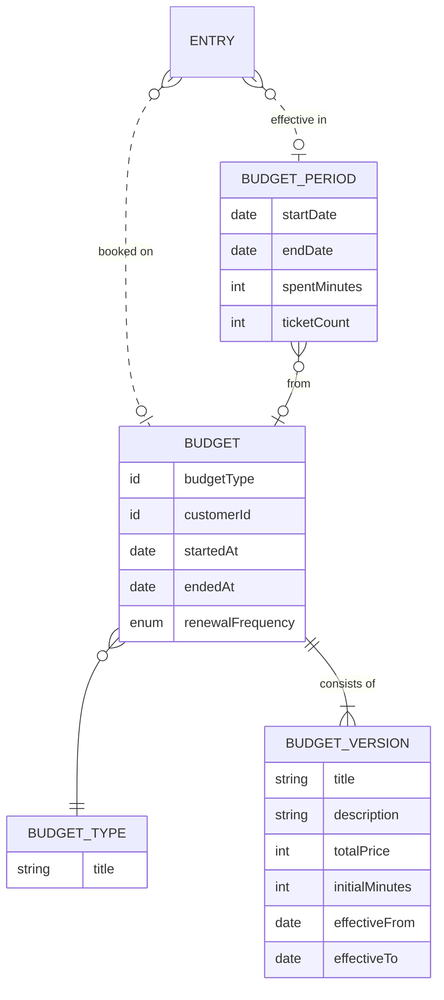
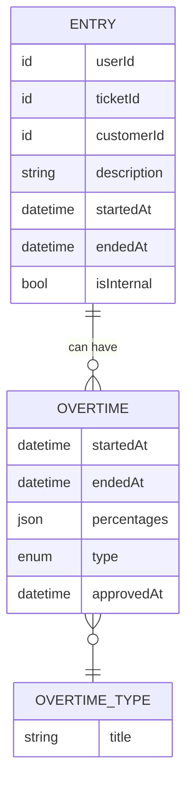
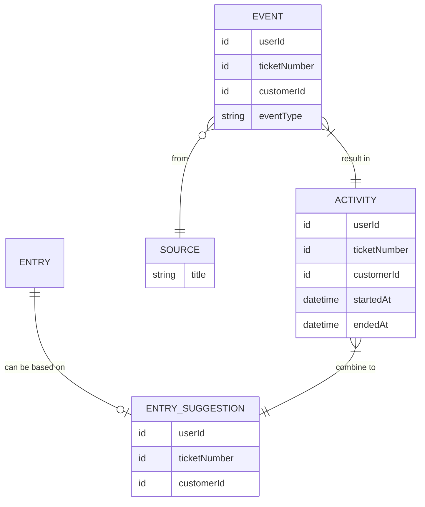

## Overview of Timatic

The Timatic application is made to register the work done by engineers.
They have to record what they've worked on and register it with data like 'customer', 'ticket' and 'budget'.

A core concept of Timatic is 'Suggestions'. We aim to collect events from several other applications which we group into activities.
Based on those activities we can generate suggestions for time entries, so engineers can even record work they forgot about.

The handling of recorded work results in hours that need to be invoiced (in Gaia) and budgets that decrease.
A rather large part of Timatic resolves around the financial handling of the hours.

## Entities

This project consists of the following entities



## Budgets, versions and periods

Budgets were a simple concept at first, but we had to keep record of previous versions of a budget.
e.g. when a budget is changed, this change happens at a certain time and shouldn't effect the state in the past.
The fields that are mutable and that are allowed to change are moved from `budgets` to `budget_versions`.
Fields that are immutable are kept on the budget model.

An entry is simply booked on a budget without knowing in what period it is.
Periods are dynamically generated based on the `budget.renewal_frequency`.
More information  on this topic can be found in the [business rules documentation](./business-rules.md#periods).



## Entries and Overtime

Entries are created by engineers and ticket, customer, datetime, settlement and description are required fields.
Ticket can only be empty when the customer is assigned to the Tenant customer.

When an entry has `isInternal: false` and `budgetId: NULL` it is consider to be 'paid per hour' 

One time entry can have a single personal overtime relation and a single customer overtime relation.

Depending on the actual time a different percentage is applied e.g. 135% for evening and 150% for night.
One overtime record can be in multiple time periods with different percentages.

Overtime example
```json
{
    "entryId": "1234",
    "type": "personal",
    "startedAt": "2021-03-01 18:00",
    "endedAt": "2021-03-01 01:00",
    "percentages": {
        "night": {"minutes": 60, "percentage": "150"},
        "evening": {"minutes": 360, "percentage": "135"}
    }
}
```



## Suggestions

The idea is that suggestions are made from combined events, which we call activities, that happen chronologically one after the other.
Events however come in from different sources in different forms so we parse and group `events` into `activities`.
Some fields in the event can be missing, depending on the source.   


